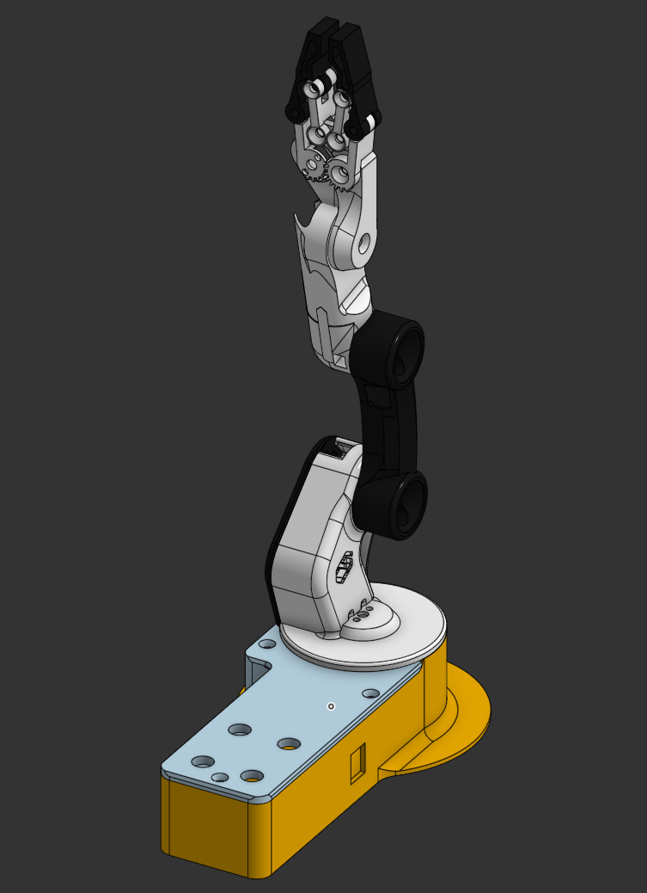

# Robotic Arm Assembly

## Overview
This project focuses solely on the mechanical **assembly** of a robotic arm system.  
All components were pre-designed, and the task was limited to assembling them into a complete articulated robotic arm.

## Assembly Purpose
The objective of this assembly is to understand:
- How multiple robotic arm joints are assembled and aligned.
- The mechanical structure of an articulated robotic arm.
- The integration of a base, arm links, and an end-effector (gripper).

The robotic arm is designed to demonstrate basic pick-and-place motion and articulated movement.

This assembly was created **for learning and practice purposes only**, as part of hands-on training in mechanical design and robotics.

## Assembly Scope
- Assembly of pre-designed robotic arm components only.
- No part modeling was performed.
- Focus on correct joint alignment, rotational movement, and overall structural integration.

## Onshape Link
[View Assembly on Onshape](https://cad.onshape.com/documents/e3bd8ec72fd1965c7c460045/w/efc5c314086b705bb97cb7f0/e/3194d0fbfa50916d6639673b?renderMode=0&uiState=697a6b44dffb941bdd34b9a5)

## Youtube Link
[View The video](https://youtu.be/KVSKOFohiUA)
